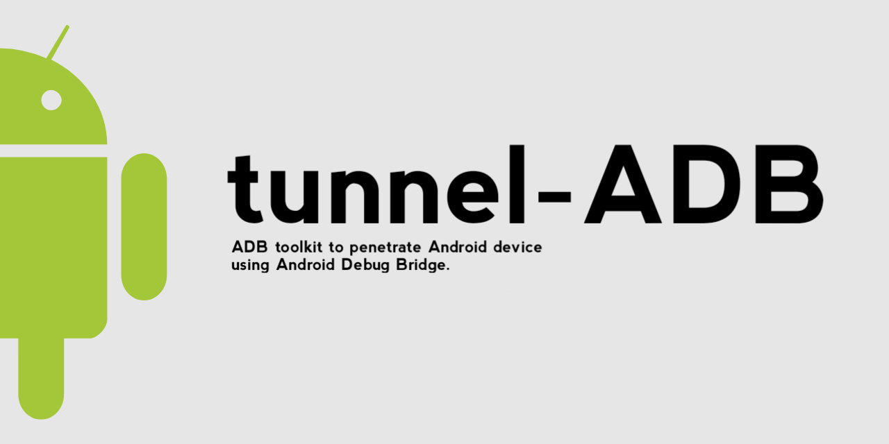
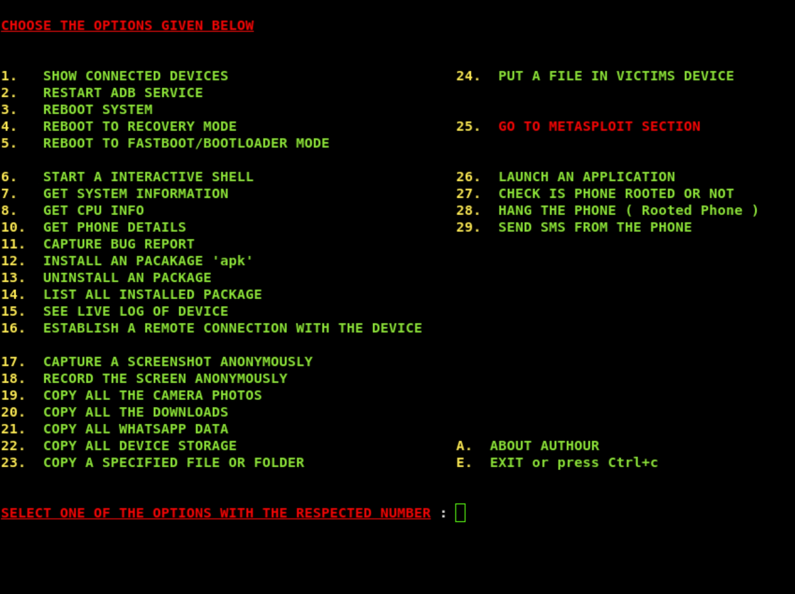
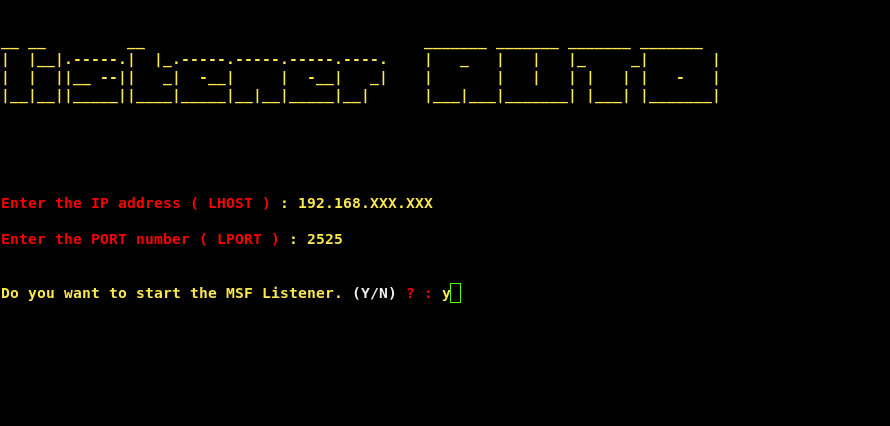
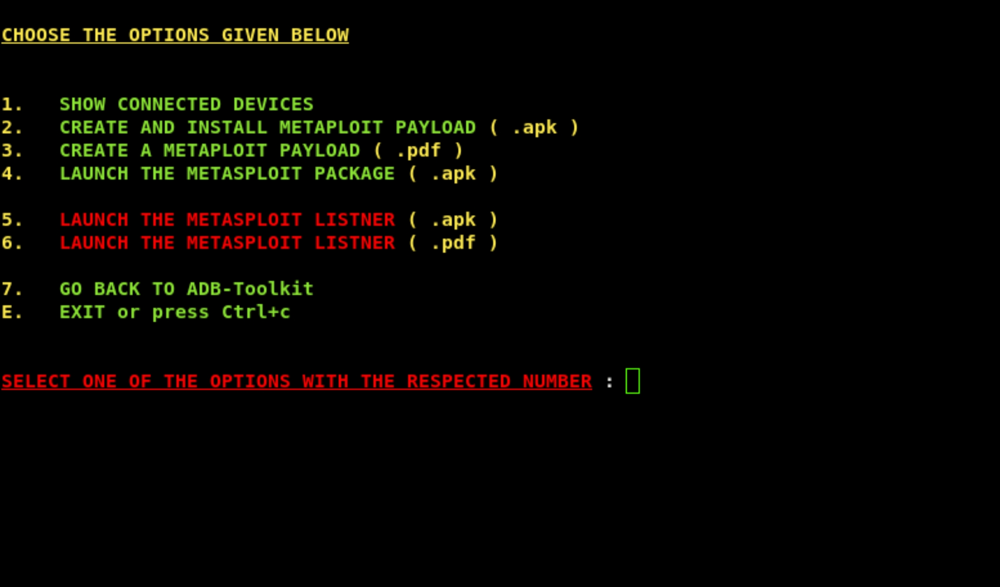
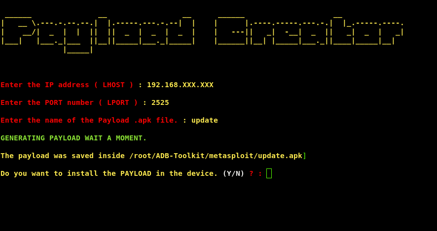

<div align="center" markdown="1">

[](https://github.com/krishealty/tunnel-ADB)
[](https://krish.l5.ca)

</div>

<p align="center">
  <a href="https://github.com/krishealty/tunnel-ADB">
    </a><br>
  </a>
  <a href="https://github.com/krishealty/tunnel-ADB">
  </a>
  </p>
  
## tunnel-ADB

**Simple ADB toolkit to penetrate Android device using Android Debug Bridge. tunnel-ADB divided into 28 options with a METASPLOIT Section and other 6 options to penetrate different areas of android device.**


**METASPLOIT SECTION:** This consists of scripts which are related to metasploit payload and you can create, install and launch a payload without physically connecting the subject's device.

## Features

- Copy specific folder, file, document or full phone storage.
- Install, Uninstall and Launch any application.
- Check Root Status of subject's phone.
- Hard Crashing the phone (Root).
- Send SMS from subject's phone.
- Multi device support.
- Support to Arch, Fedora, Centos.
- Flexibility during restarting ADB server.
- Simplified Remote connection establishment.
- Specified directories for the data.
- Copy all camera photos.
- Copy WhatsApp data.
- Reboot fastboot or Recovery mode.          
- Dump system information.
- Dump CPU information.
- Dump memory information.
- Dump contacts.
- Live log of phone sessions.

## Prerequisites

Developer options and Usb Debugging needs to be turned on.

```
1. Go to settings
2. Go to About device/tablet
3. Tap Build Number 7 times
4. Developer options will occur
5. Go to Developer options
6. Search for Usb Debugging & Install via USB
7. Turn those settings on
```

## Installation for Kali Linux or any Debian

```
git clone https://github.com/krishealty/tunnel-ADB.git
```

```
cd tunnel-ADB
```

```
sudo chmod +x install.sh
```

```
sudo ./install.sh -i
```

**Start the script**

```
sudo ./tunnel-ADB.sh
```

OR

```
sudo bash tunnel-ADB.sh
```

## Termux

Turn on the "otg connection" in both devices to connect with otg cable.

```
git clone https://github.com/krishealty/tunnel-ADB.git
```

```
cd tunnel-ADB
```

```
chmod +x install.sh
```

```
bash install.sh
```

**Start the Script**

```
bash tunnel-ADB.sh
```

## tunnel-ADB Screenshot

<p align="center">
    <br>
</p>

## Metasploit Section Screenshot

<p align="center">
    <br><br>
    <br><br>
    <br><br>
</p>


